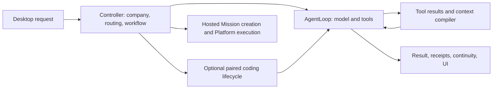

# Agent loop and Desktop audit — September 9, 2026

The execution foundation is useful, but completion and verification are inconsistent across tasks. Desktop can create a real unpublished page, read company records, route to hosted models, retain checkpoints, and recover a conversation. Those capabilities do not yet add up to a dependable employee experience: successful writes can lose their evidence, ordinary deliverables have no required artifact checker, and recovery can distort both status and presentation.

This review combines installed Desktop 1.0.53 testing in Northwind, Rick's screenshots and reports, source tracing, and deterministic regressions. It is not a complete connected-customer acceptance test. Northwind has no Meta/accounting connections; no lead, message, publication, ad spend, or account grant was submitted. Computer Use suffered intermittent capture/AX failures, so native control failures are not attributed to AMOS without separate evidence.

## Findings and disposition

| Priority | Finding | Evidence | Disposition / acceptance |
| --- | --- | --- | --- |
| P0 | Context compaction discards active tool results and steering. | `contextCompiler.conversationTurns` stopped at the active user index. Four compiler regressions and an AgentLoop page-edit regression fail on the released code. The live revision repeatedly saved alternate pages. | Fixed in PR279, merged `e9235de`. 948 tests and CI passed. Needs a released build and live replay; not proof that every loop is fixed. |
| P1 | A returned interruption is stored as a completed run. | `DesktopRunManager.launch` marked any resolved executor promise completed, including `{ interrupted: true }`. Reproduced directly. | This patch preserves interruption status and the terminal-state fence. Test provider timeout, provider failure, sleep, budget, and a late result after cancellation. |
| P1 | Every interruption toast says the model timed out. | Renderer `runTask` used one literal for all `result.interrupted` outcomes, although controller supplies distinct recovery reasons. | This patch shares reason-specific messages between run state and renderer. Unknown reasons remain generic. |
| P1 | Base company work has no enforced artifact plan/build/check lifecycle. | `controller` creates `CodingLifecycle` only when paired coding is enabled and the workflow family is coding. The QA page ran ordinary Auto/balanced. `runCompletionGate` otherwise covers Mission creation, not page quality. | Implement the substantial-deliverable path below. Leave simple questions fast. Do not require external provider keys to get this behavior. |
| P1 | Generated form and deployed intake disagree. | Page has name/email; Platform confirmed deployed intake also requires company, challenge, and UUID idempotency. Draft intake returns 404; direct UTM body fields are ignored. | Platform owns a machine-readable contract and side-effect-free validation tool. A saved HTML file is not proof of a working form. |
| P1 | Restored responses lose Markdown structure. | Rick's screenshot and restored AX show a whole response flattened into a heading/code spans. Platform `working_continuity::scrub_text` replaces controls and joins whitespace. Local continuity preserves line breaks before shared hydration. | Platform asked to verify deployed path and preserve formatting while retaining redaction and size limits. Round-trip lists, tables, fenced code and newline-separated credentials. |
| P1 | Revisiting an existing site lacks an adequate edit/read contract. | Sites exposes manifests/hashes and file writes, but no authenticated source-file read. The model explicitly said it relied on earlier in-context HTML. Private preview tokens are redacted from restored text. | Platform to add bounded tenant-authorized source reads and private preview reopening by stable artifact reference. Keep secret redaction; do not make drafts public. |
| P2 | Repeated-work guard recognizes identical arguments, not repeated semantic rewrites. | `toolPlanFingerprint` includes arguments; changing the generated HTML changes the fingerprint. The 64-cycle overall ceiling is much later than a good recovery point. | Add task-stage progress evidence, not a blanket ban on repeated tool names. A rewrite needs a specific unmet criterion/new direction. Preserve legitimate iterative work and pagination. |
| P2 | Guarded partial synthesis can still flow through success accounting. | `summarizeGuardedStop` returns a string and emits a completed phase labelled “Task paused”; normal controller completion records completed receipts and calls `recordFirstVerifiedOutcome`. That acquisition event requires only a completed tool event. | Introduce one structured outcome contract across loop, controller, receipt, UI and learning export. Keep acquisition/tool-use metrics separate from verified user outcomes. This patch only fixes explicitly returned interruption results. |
| P2 | Progress UI overemphasizes internal activity. | Live page revision showed routing, long thought snippets and many tool cards while missing a concise “draft saved / checking / repair needed” state. | Make stage, latest concrete result, elapsed time and pending check primary. Keep raw calls, tokens and served model in expandable diagnostics. Preserve Stop and steering. |
| P2 | Read metadata is incomplete across the boundary. | Desktop registers remote read-only behavior only from annotations. Site status/list schemas inspected lack those annotations. | Platform should supply explicit authoritative effect metadata. Do not infer safety from a tool's name or use “read-only” to bypass tenant authority. Verify delivered catalog before changing parallelism. |
| P2 | Tests overrepresent shape rather than user success. | Old context tests asserted task/budget retention while overlooking the disappearing active results; one renderer contract pinned the inaccurate timeout string. | Add stateful regressions and real task acceptance, with exact result preservation and failure recovery. Keep useful unit tests, but do not use their count as product-readiness evidence. |

## Existing architecture

Workflow prose, paired coding, local answer review, and hosted Mission verification are distinct mechanisms today. The optional hybrid reviewer reviews text answers with no tools and returns tool-bearing drafts without that review; it is not a browser or form checker. Reuse these foundations, but do not describe them as a universal planner/checker already running in the default product.

The immediate fix should remain provider-independent. Planning and checking can use the same qualified owned model in separate stages with bounded context. Specialized weights, recurrent compute and learned routing are later optimizations, measured against this execution contract.

## Proposed substantial-deliverable path

1. **Choose the amount of process.** Direct answers and bounded reads stay on the short path. Creation or material changes to a deliverable select a durable task plan. Start with hosted sites as a narrow vertical slice, then expand from measured results.
2. **Plan the outcome.** Record audience, requested change, artifact references, constraints and a few observable acceptance criteria. Infer ordinary design decisions from the brief and company. Ask only for consequential missing information. The plan should not introduce a new approval ceremony.
3. **Build with retained evidence.** Read the existing artifact, make the change, and retain the save receipt and revision. Separate completed actions from unfinished checks. Recover from those records instead of restarting the request.
4. **Check the artifact.** Run deterministic checks first, then a bounded independent review of the actual output. For sites: rendered desktop/mobile page, copy fidelity, layout/contrast, CTA/link behavior, lead-contract validation and truthful integration limits. A manifest hash alone cannot establish visual quality. A static form check cannot establish delivered CRM attribution.
5. **Repair only named defects.** Give the builder the failed criterion and evidence. A new revision invalidates the previous review. Limit automatic repair cycles; on exhaustion deliver the usable draft with a precise incomplete status instead of more silent rewrites.
6. **Finish with one coherent result.** Show the artifact, what changed, what was checked, and any material limit. Internally distinguish verified delivery, delivery with limits, needs input, interruption and failure. Propagate that same state into receipts, history and eligible learning records.

Plans and review records should carry tenant, task, artifact identifier, saved revision/digest, criterion results, observed evidence references and unresolved checks. Tool evidence references must resolve to controller-recorded results. An assertion from the builder or checker is not by itself a verified tool outcome. Preserve the Platform's authority and consent contracts.

## UX changes in delivery order

1. **Stop surprising people after recovery.** Correct interruption status and explanation; preserve rich text and artifact access across restart. If Stop fails, restore a usable retry control and show that it failed; don't leave a permanently disabled “Stopping…” button. The current renderer lacks a reset on cancellation failure; exercise this with an IPC-failure UI test before altering it.
2. **Show a short working plan and real progress.** “Creating the draft”, “Draft saved”, “Checking mobile layout”, “Repairing form fields”, “Ready for review”. Group repeated work by stage and surface prolonged no-progress time. Keep technical evidence available on demand.
3. **Deliver the work in the app.** Put a stable page preview and its verification state alongside the chat, with clear draft/published status. Separate normal response prose from receipts, raw schema details and private-link handling.
4. **Give default output a quality baseline.** Have the page workflow apply a sensible visual direction, typography, spacing and CTA hierarchy without requiring the user to act as an art director. Use only approved claims and supplied assets. Label illustrative examples without laundering invented performance benchmarks into credibility.
5. **Optimize measured latency.** Record time to first useful action, save, review and final answer; model-call count; repeated writes; input/schema tokens; and time spent waiting on services. Reduce unnecessary context and discovery after fixing retention. Do not add planner/checker calls to greetings or simple reads.

## Acceptance before the partner trial is called ready

- Create a draft from an ordinary brief, revise its copy/theme, reopen it in a new conversation, restart Desktop, and continue without repeating completed writes.
- Confirm draft identity and saved revision; compare desktop and mobile rendering; check the CTA and validate the real form contract. Use Platform's no-effect validation until an authorized end-to-end lead test is available.
- Exercise Stop, queued steering, transient model failure, budget exhaustion and sleep. A late result must not overwrite a newer task or relabel interruption as success.
- Test Auto and manual Frontier with actual served-model evidence; restore the original setting. The completed QA creation/revision used base Qwen, not a demonstrated Frontier run.
- With a properly connected test account, demonstrate ad → visit → lead → paid sale → accounting attribution, including missing/ambiguous attribution. Northwind's disconnected fixture cannot prove the promise made to Jana.
- Compare simple-question latency before/after the new lifecycle and measure substantial-task completion, repair rate and user intervention. Keep these separate from model-training evaluation.

## Ownership and next milestones

Codex owns the Desktop loop, task outcome contract, default artifact lifecycle and UI. Platform owns site/form contracts, authenticated artifact access, shared continuity and business verification semantics. Organism owns model/curriculum experiments and consumes only appropriately classified, permitted evidence.

First ship the narrowly reproduced retention and interruption fixes. Platform ships the form contract and formatting repair. Next implement and measure the landing-page lifecycle on the default owned-model path. Only then expand it to other deliverables and use those checked outcomes as learning examples. A candidate model should not be punished for a dropped tool result, broken tool contract, or infrastructure failure.
